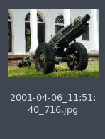

[](https://travis-ci.org/clabroche/imageRenamer)
[](https://clabroche.github.io/imageRenamer)

# Image Renamer 

Simple CLI Image renamer based on exif metadata

## Install
``` bash
git clone https://github.com/clabroche/imageRenamer.git
cd imageRenamer
npm i
```

## Usage

``` bash
node app <path to images directory>
```

By default: 
 - output directory => 'out< date taken on exif metadatas >.< extension >'

 => 

 - output no Exif => 'out/No Date/< initial filename >.< extension >'
 
 => 

 - output no date taken metadata => 'out/< modifyDate >.< extension >'

 => 
